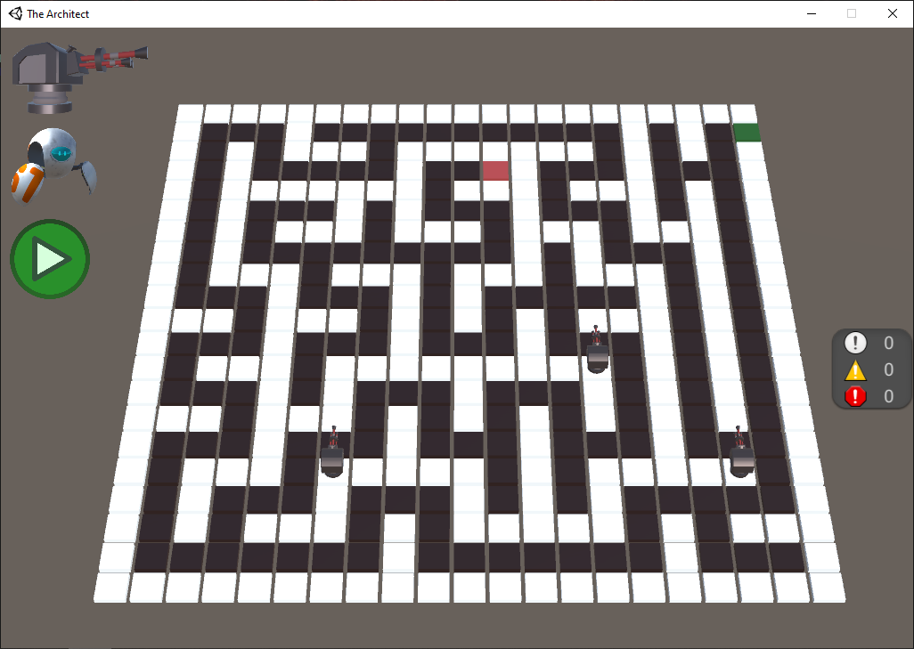

Proof of concept coding game that uses the [Pigeon](https://github.com/kostic017/pigeon) programming language.



# Built-ins

If functions returns `any`, variants with `_i` (int), `_f` (float), and `_b` (bool) suffixes are available.

## Turret

```
float RANGE;

float x();
float y();
void shoot(int index);

int robot_count();
float robot_x(int index);
float robot_y(int index);

float sqrt(float n);
void print(any message);
```

## Robot

```
int EXIT_C;
int EXIT_R;

int LEVEL_WIDTH;
int LEVEL_HEIGHT;

int c();
int r();

void move_up();
void move_down();
void move_left();
void move_right();

string get_tile(int col, int row);

int string_len(string str);
string string_char(string str, int index);

int set_create();
void set_destroy(int set);
void set_add(int set, any value);
void set_remove(int set, any value);
bool set_in(int set, any value);

void print(any message);

void global_set(string name, any value);
void global_unset(string name);
bool global_check(string name);
any global_get(string name);
```